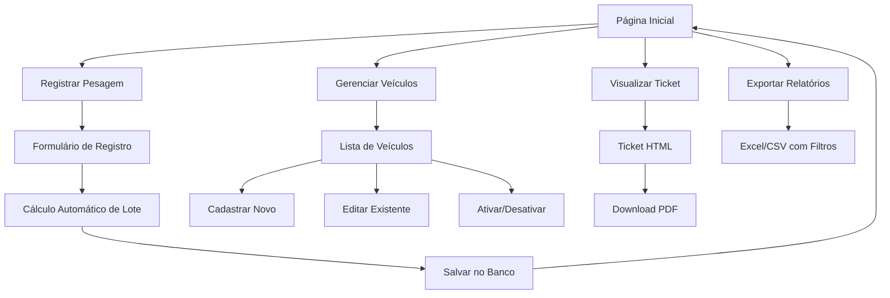

# Documentação Completa - Sistema de Pesagem de Caminhões

## Índice
1. [Visão Geral do Sistema](#visão-geral-do-sistema)
2. [Arquitetura e Tecnologias](#arquitetura-e-tecnologias)
3. [Fluxo de Navegação](#fluxo-de-navegação)
4. [Documentação das Telas](#documentação-das-telas)
5. [Funcionalidades Principais](#funcionalidades-principais)
6. [Interações e APIs](#interações-e-apis)
7. [Regras de Negócio](#regras-de-negócio)
8. [Estrutura de Arquivos](#estrutura-de-arquivos)

---

## Visão Geral do Sistema

O Sistema de Pesagem de Caminhões é uma aplicação web desenvolvida em Flask para gerenciar operações de pesagem de caminhões no Distrito Federal. O sistema permite registrar pesagens, calcular valores de carga baseados em lotes específicos por região, gerar tickets em PDF e relatórios em Excel/CSV.

### Objetivos Principais
- Registrar dados de pesagem de caminhões
- Calcular automaticamente valores de carga por lote/região
- Gerar tickets de pesagem em PDF
- Exportar relatórios completos
- Gerenciar cadastro de veículos
- Filtrar e buscar registros

---

## Arquitetura e Tecnologias

### Backend
- **Framework**: Flask (Python)
- **ORM**: SQLAlchemy 2.0+
- **Banco de Dados**: SQLite (desenvolvimento) / PostgreSQL (produção)
- **Servidor**: Gunicorn (produção)

### Frontend
- **Template Engine**: Jinja2
- **CSS Framework**: Bootstrap 5
- **Ícones**: Font Awesome 6.4.0
- **JavaScript**: Vanilla JS com componentes Bootstrap

### Bibliotecas Principais
- **ReportLab**: Geração de PDFs
- **OpenPyXL**: Exportação para Excel
- **Werkzeug**: Utilities WSGI e proxy

---

## Fluxo de Navegação



---

## Documentação das Telas

### 1. Página Inicial (index.html)
**Rota**: `/`  
**Template**: `templates/index.html`  
**Função**: `routes.index()`

#### Funcionalidades
- **Lista de Pesagens**: Exibe todas as pesagens registradas em ordem cronológica reversa
- **Filtros Avançados**:
  - Período (data início/fim)
  - Lote (3 ou 5)
  - Placa do veículo
  - Veículo específico (dropdown)
- **Estatísticas em Cards**:
  - Total de pesagens
  - Peso total transportado
  - Valor total das cargas
  - Média por carga
- **Ações por Registro**:
  - Visualizar ticket
  - Download PDF
  - Editar pesagem
  - Excluir registro

#### Elementos da Interface
```html
<!-- Seção de Filtros -->
<div class="filter-section">
    <form method="GET">
        <input type="date" name="data_inicio">
        <input type="date" name="data_fim">
        <select name="lote">
        <input type="text" name="placa">
        <select name="veiculo_id">
    </form>
</div>

<!-- Cards de Estatísticas -->
<div class="row stats-cards">
    <div class="col-md-3">
        <div class="card stats-card bg-primary">
            <h3>{{ pesagens|length }}</h3>
            <h5>Total de Pesagens</h5>
        </div>
    </div>
</div>

<!-- Tabela de Pesagens -->
<table class="table table-responsive">
    <thead>
        <tr>
            <th>Placa</th>
            <th>Motorista</th>
            <th>Local de Carga</th>
            <th>Lote</th>
            <th>Data</th>
            <th>Peso (Kg)</th>
            <th>Valor</th>
            <th>Ações</th>
        </tr>
    </thead>
</table>
```

#### Interações JavaScript
- **Filtros Dinâmicos**: Aplicados via form submission
- **Confirmação de Exclusão**: Modal Bootstrap
- **Tooltips**: Informações adicionais nos botões

### 2. Registro de Pesagem (registro.html)
**Rota**: `/registro`  
**Template**: `templates/registro.html`  
**Função**: `routes.registro()`

#### Funcionalidades
- **Formulário de Registro**: Campos para todos os dados da pesagem
- **Autocomplete de Veículos**: Dropdown com veículos cadastrados
- **Autocomplete de Motorista**: Busca motorista padrão por placa
- **Validação em Tempo Real**: JavaScript valida cidades e dados
- **Cálculo Automático**: Lote e valor calculados no backend

#### Campos do Formulário
```python
campos = {
    'local_carga': 'Local de Carga (obrigatório)',
    'local_descarga': 'Local de Descarga (obrigatório)', 
    'data': 'Data da Pesagem (obrigatório)',
    'placa_veiculo': 'Placa do Veículo (obrigatório)',
    'motorista': 'Nome do Motorista (obrigatório)',
    'quantidade_kg': 'Quantidade em Kg (obrigatório)'
}
```

#### Validações Implementadas
- Todos os campos obrigatórios preenchidos
- Quantidade > 0
- Data válida
- Cidade de carga existe na lista de lotes
- Placa no formato correto

#### Fluxo de Processamento
1. **Entrada de Dados**: Usuário preenche formulário
2. **Validação Frontend**: JavaScript valida campos em tempo real
3. **Validação Backend**: Flask valida dados recebidos
4. **Cálculo de Lote**: `utils.calcular_lote_e_valor()`
5. **Busca de Veículo**: Relaciona com veículo cadastrado se existir
6. **Persistência**: Salva no banco via SQLAlchemy
7. **Redirecionamento**: Volta para página inicial com mensagem

### 3. Gerenciamento de Veículos (veiculos.html)
**Rota**: `/veiculos`  
**Template**: `templates/veiculos.html`  
**Função**: `routes.veiculos()`

#### Funcionalidades
- **Lista de Veículos**: Todos os veículos com status ativo/inativo
- **Estatísticas por Veículo**: Número de pesagens realizadas
- **Filtro por Status**: Ativos/Inativos
- **Ações CRUD Completas**:
  - Cadastrar novo veículo
  - Editar dados existentes
  - Ativar/desativar veículo
  - Visualizar histórico de pesagens

#### Estrutura da Tabela
```html
<table class="table">
    <thead>
        <tr>
            <th>Placa</th>
            <th>Marca/Modelo</th>
            <th>Ano</th>
            <th>Cor</th>
            <th>Motorista Padrão</th>
            <th>Pesagens</th>
            <th>Status</th>
            <th>Ações</th>
        </tr>
    </thead>
</table>
```

### 4. Cadastro de Veículo (novo_veiculo.html)
**Rota**: `/veiculos/novo`  
**Template**: `templates/novo_veiculo.html`  
**Função**: `routes.novo_veiculo()`

#### Campos do Formulário
- **Placa**: Campo obrigatório, único no sistema
- **Marca**: Campo obrigatório
- **Modelo**: Campo obrigatório  
- **Ano**: Campo opcional, numérico
- **Cor**: Campo opcional
- **Motorista Padrão**: Campo opcional, usado no autocomplete

#### Validações
- Placa única no sistema
- Campos obrigatórios preenchidos
- Ano numérico válido (se preenchido)

### 5. Edição de Veículo (editar_veiculo.html)
**Rota**: `/veiculos/<id>/editar`  
**Template**: `templates/editar_veiculo.html`  
**Função**: `routes.editar_veiculo()`

#### Funcionalidades
- Formulário pré-preenchido com dados atuais
- Mesmas validações do cadastro
- Verificação de placa única (excluindo o próprio veículo)
- Botão para cancelar e voltar

### 6. Visualização de Ticket (ticket.html)
**Rota**: `/ticket/<id>`  
**Template**: `templates/ticket.html`  
**Função**: `routes.ticket()`

#### Funcionalidades
- **Exibição Formatada**: Todos os dados da pesagem organizados
- **Layout para Impressão**: CSS otimizado para impressão
- **Download PDF**: Botão para gerar PDF via ReportLab
- **Informações Completas**:
  - Dados do veículo e motorista
  - Locais de carga/descarga
  - Peso, lote e valor calculado
  - Data/hora de geração

#### Estrutura do Ticket
```html
<div class="ticket-container">
    <h1>TICKET DE PESAGEM</h1>
    <table class="ticket-info">
        <tr><td>Data:</td><td>{{ pesagem.data.strftime('%d/%m/%Y') }}</td></tr>
        <tr><td>Placa:</td><td>{{ pesagem.placa_veiculo }}</td></tr>
        <tr><td>Motorista:</td><td>{{ pesagem.motorista }}</td></tr>
        <tr><td>Local da Carga:</td><td>{{ pesagem.local_carga }}</td></tr>
        <tr><td>Local da Descarga:</td><td>{{ pesagem.local_descarga }}</td></tr>
        <tr><td>Peso:</td><td>{{ pesagem.quantidade_kg }} kg</td></tr>
        <tr><td>Lote:</td><td>{{ pesagem.lote }}</td></tr>
        <tr><td>Valor:</td><td>R$ {{ pesagem.valor_carga }}</td></tr>
    </table>
</div>
```

### 7. Edição de Pesagem (editar_pesagem.html)
**Rota**: `/pesagem/<id>/editar`  
**Template**: `templates/editar_pesagem.html`  
**Função**: `routes.editar_pesagem()`

#### Funcionalidades
- Formulário idêntico ao registro, mas pré-preenchido
- Recálculo automático de lote/valor se cidade ou peso mudarem
- Mesmas validações do registro
- Atualização do relacionamento com veículo

---

## Funcionalidades Principais

### 1. Sistema de Lotes
O sistema automaticamente determina o lote baseado na cidade de carga:

```python
# Lote 3 - R$ 575,75 por tonelada
LOTE_3_CIDADES = [
    'Guará', 'Arniqueiras', 'Águas Claras', 'Park Way', 
    'Núcleo Bandeirante', 'Candangolândia', 'SCIA/Estrutural',
    'Vicente Pires', 'Riacho Fundo I', 'Sobradinho', 
    'Sobradinho II', 'Fercal', 'Planaltina', 'Arapoanga',
    'Paranoá', 'Itapoã'
]

# Lote 5 - R$ 591,82 por tonelada  
LOTE_5_CIDADES = [
    'Lago Sul', 'Jardim Botânico', 'São Sebastião', 'Brazlândia',
    'Ceilândia', 'Taguatinga', 'Sol Nascente/Por do Sol', 'Gama',
    'Santa Maria', 'Recanto das Emas', 'Água Quente', 
    'Samambaia', 'Riacho Fundo II'
]
```

### 2. Cálculo Automático de Valores
```python
def calcular_lote_e_valor(local_carga, quantidade_kg):
    cidade_normalizada = local_carga.strip().title()
    
    # Determina o lote pela cidade
    if cidade in LOTE_3_CIDADES:
        toneladas = quantidade_kg / 1000
        valor_carga = toneladas * VALOR_LOTE_3
        return 3, round(valor_carga, 2)
    
    if cidade in LOTE_5_CIDADES:
        toneladas = quantidade_kg / 1000
        valor_carga = toneladas * VALOR_LOTE_5
        return 5, round(valor_carga, 2)
    
    return None, None  # Cidade não encontrada
```

### 3. Geração de PDFs
Utiliza ReportLab para criar tickets formatados:

```python
def gerar_ticket_pdf(pesagem, caminho_arquivo):
    doc = SimpleDocTemplate(caminho_arquivo, pagesize=A4)
    
    # Elementos do documento
    story = []
    story.append(Paragraph("TICKET DE PESAGEM", title_style))
    
    # Tabela com dados
    data = [
        ['Data:', pesagem.data.strftime('%d/%m/%Y')],
        ['Placa:', pesagem.placa_veiculo],
        ['Peso:', f'{pesagem.quantidade_kg:,.0f} kg'],
        ['Valor:', f'R$ {pesagem.valor_carga:,.2f}']
    ]
    
    table = Table(data)
    story.append(table)
    doc.build(story)
```

### 4. Exportação de Relatórios
Suporte para Excel e CSV com filtros aplicados:

```python
def gerar_relatorio_excel(pesagens, caminho_arquivo):
    wb = openpyxl.Workbook()
    ws = wb.active
    
    # Cabeçalhos formatados
    headers = ['Placa', 'Motorista', 'Cidade', 'Lote', 'Data', 'Kg', 'Valor']
    
    # Aplicar dados e formatação
    for row, pesagem in enumerate(pesagens, 2):
        ws.cell(row=row, column=1, value=pesagem.placa_veiculo)
        # ... outros campos
    
    wb.save(caminho_arquivo)
```

---

## Interações e APIs

### 1. API REST para Veículos
**Endpoint**: `/api/veiculo/<placa>`  
**Método**: GET  
**Função**: Buscar dados do veículo pela placa

```python
@app.route('/api/veiculo/<placa>')
def get_veiculo_info(placa):
    veiculo = Veiculo.query.filter_by(placa=placa.upper()).first()
    if veiculo:
        return jsonify({
            'exists': True,
            'motorista_padrao': veiculo.motorista_padrao,
            'modelo': veiculo.modelo,
            'marca': veiculo.marca
        })
    return jsonify({'exists': False})
```

### 2. JavaScript Interativo
**Arquivo**: `static/js/main.js`

#### Autocomplete de Veículo
```javascript
document.getElementById('placa_veiculo').addEventListener('input', function() {
    const placa = this.value.trim().toUpperCase();
    if (placa.length >= 3) {
        fetch(`/api/veiculo/${placa}`)
            .then(response => response.json())
            .then(data => {
                if (data.exists && data.motorista_padrao) {
                    document.getElementById('motorista').value = data.motorista_padrao;
                }
            });
    }
});
```

#### Validação de Cidades
```javascript
function isValidCity(city) {
    const validCities = [
        // Lista de cidades dos lotes 3 e 5
    ];
    return validCities.some(validCity => 
        city.toLowerCase().includes(validCity.toLowerCase())
    );
}
```

### 3. Filtros Dinâmicos
Os filtros são aplicados via parâmetros GET e processados no backend:

```python
# Construir query com filtros
query = Pesagem.query

if data_inicio:
    data_inicio_obj = datetime.strptime(data_inicio, '%Y-%m-%d')
    query = query.filter(Pesagem.data >= data_inicio_obj)

if lote and lote.isdigit():
    query = query.filter(Pesagem.lote == int(lote))

if placa:
    query = query.filter(Pesagem.placa_veiculo.ilike(f'%{placa}%'))

pesagens = query.order_by(Pesagem.created_at.desc()).all()
```

---

## Regras de Negócio

### 1. Validações de Entrada
- **Peso**: Deve ser > 0
- **Data**: Não pode ser futura (implementar se necessário)
- **Cidade**: Deve estar na lista de lotes cadastrados
- **Placa**: Formato brasileiro (implementar regex se necessário)

### 2. Cálculos Automáticos
- **Lote**: Determinado automaticamente pela cidade de carga
- **Valor**: (Peso em kg ÷ 1000) × Valor por tonelada do lote
- **Relacionamento**: Pesagem vinculada ao veículo se cadastrado

### 3. Status de Veículos
- **Ativos**: Aparecem nos dropdowns e autocomplete
- **Inativos**: Mantidos no histórico mas não disponíveis para nova pesagem
- **Soft Delete**: Veículos não são excluídos, apenas desativados

### 4. Integridade de Dados
- **Placa Única**: Um veículo por placa no sistema
- **Pesagem Independente**: Mantém placa mesmo se veículo for removido
- **Relacionamento Opcional**: Pesagem funciona sem veículo cadastrado

---

## Estrutura de Arquivos

```
projeto/
├── app.py                 # Configuração principal do Flask
├── main.py               # Ponto de entrada da aplicação
├── models.py             # Modelos do banco de dados
├── routes.py             # Todas as rotas e controllers
├── utils.py              # Funções auxiliares e cálculos
├── static/
│   ├── css/
│   │   └── custom.css    # Estilos personalizados
│   └── js/
│       └── main.js       # JavaScript interativo
├── templates/
│   ├── base.html         # Template base com navegação
│   ├── index.html        # Página inicial com lista
│   ├── registro.html     # Formulário de pesagem
│   ├── veiculos.html     # Lista de veículos
│   ├── novo_veiculo.html # Cadastro de veículo
│   ├── editar_veiculo.html # Edição de veículo
│   ├── editar_pesagem.html # Edição de pesagem
│   ├── ticket.html       # Visualização de ticket
│   ├── 404.html          # Página de erro 404
│   └── 500.html          # Página de erro 500
├── docs/
│   ├── database_documentation.md  # Documentação do banco
│   └── documentacao_completa.md   # Esta documentação
├── .replit               # Configuração do Replit
├── pyproject.toml        # Dependências Python
└── replit.md            # README do projeto
```

---

## Fluxos de Uso Principais

### 1. Registrar Nova Pesagem
1. Usuário acessa `/registro`
2. Preenche dados do formulário
3. Sistema valida cidade na lista de lotes
4. JavaScript busca motorista padrão se veículo cadastrado
5. Backend calcula lote e valor automaticamente
6. Dados salvos no banco
7. Redirecionamento para lista com mensagem de sucesso

### 2. Gerenciar Veículo
1. Usuário acessa `/veiculos`
2. Visualiza lista com status e estatísticas
3. Clica em "Novo Veículo" ou "Editar"
4. Preenche/atualiza dados
5. Sistema valida placa única
6. Dados salvos/atualizados
7. Volta para lista de veículos

### 3. Gerar Relatório
1. Usuário aplica filtros na página inicial
2. Clica em "Exportar Excel" ou "Exportar CSV"
3. Sistema constrói query com filtros aplicados
4. Gera arquivo temporário
5. Envia arquivo para download
6. Remove arquivo temporário após download

### 4. Visualizar/Imprimir Ticket
1. Usuário clica em "Ver Ticket" na lista
2. Sistema exibe ticket formatado
3. Usuário pode imprimir direto ou baixar PDF
4. PDF gerado via ReportLab com formatação profissional

---

## Considerações Técnicas

### 1. Performance
- **Paginação**: Não implementada - considerar para grandes volumes
- **Índices**: Recomendados para campos de busca frequente
- **Cache**: Não implementado - considerar para relatórios complexos

### 2. Segurança
- **SQL Injection**: Prevenida pelo uso do SQLAlchemy ORM
- **Validação**: Dupla validação (frontend + backend)
- **Session Management**: Flask-Session com chave configurável

### 3. Escalabilidade
- **Banco**: Configurável entre SQLite e PostgreSQL
- **Deploy**: Pronto para Gunicorn em produção
- **Proxy**: Suporte a reverse proxy configurado

### 4. Manutenibilidade
- **Separação de Responsabilidades**: Models, Views, Utils separados
- **Templates**: Herança e componentização
- **Configuração**: Variáveis de ambiente para deploy

Esta documentação serve como guia completo para entendimento, manutenção e evolução do sistema de pesagem de caminhões.
